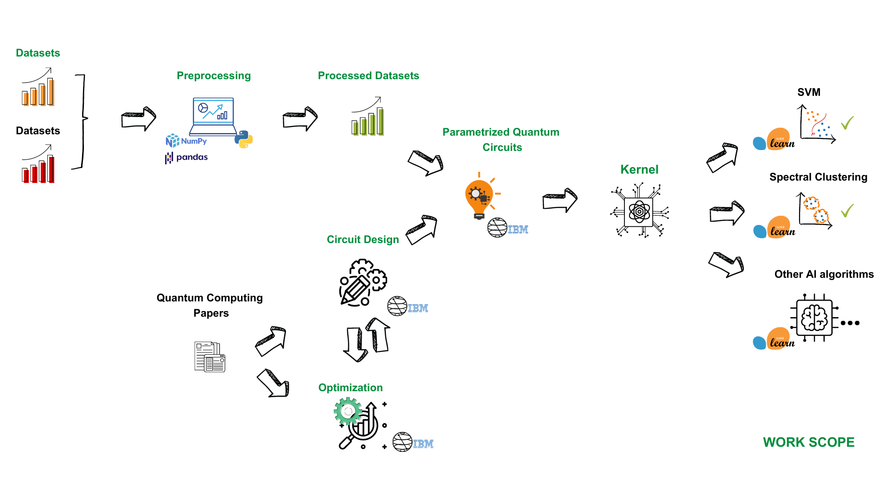

# Study of the Use of Quantum Computers to Calculate Kernel Functions for Machine Learning Applications
Bachelor's Thesis of José Miguel Nicolás García, student of the Universidad Autonoma de Madrid. The following image shows a representation of the scope of this project: 

In this work, several PQCs have been designed, implemented and studied for use in the development of quantum kernels. Many of them, being more competent for sorting in multiple datasets than the circuit proposed in the initial paper and even than the classic kernels. Their design has been based on its hardware efficiency, quantum entanglement capability and expressibility. 

Furthermore, a function that gives us the ability to calculate the expressibility of a PQC has been developed. Ergo henceforth, we will have much clearer understanding about its characteristics. This metric has been extremely beneficial because the results have allowed us to prove that it is very interesting to apply it to the design of these quantum circuits.

We have examined the performance of the Pegasos algorithm in datasets of substantial magnitude, unveiling training time accelerations of up to 75.24%. Furthermore, through the utilization of Quantum Kernel Optimizers, we have achieved classification enhancements of up to 19%.

Thereupon, we have subjected these mechanisms to testing in an algorithm divergent from the initial paradigm how Spectral Clustering is, thereby inherently showcasing their multifaceted adaptability for both supervised and unsupervised learning.

All these facts, allows us to elucidate the potential of quantum kernels in the field of QML. A continuously burgeoning field, escalating exponentially month by month, yet to fully realize its zenith of potential.
